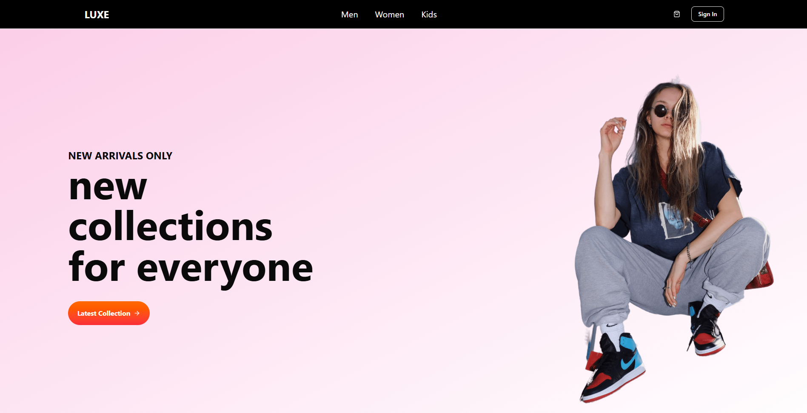
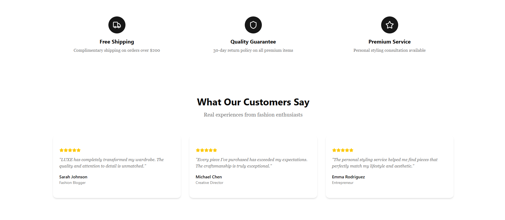
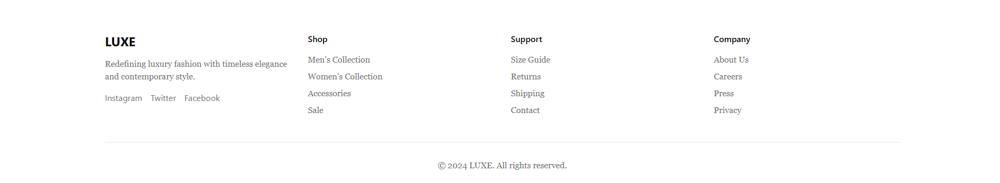

# 🛍️ E-Commerce Site (React + TypeScript)

A simple frontend-only e-commerce site built using **React**, **TypeScript**, and **Vite**.  
This project demonstrates product listing, product details, cart functionality, and filtering — all without a backend or database.  
Products are stored locally in a `assets/all_product.ts` file.

---

## 📸 Screenshots







---

## 🚀 Features
- React + TypeScript (frontend only)
- Product listing & details page
- Simple cart functionality
- Category-based filtering (Men, Women, Kids)
- Local product storage (`all_product.ts`)
- Dockerized setup for easy deployment

---

## ⚙️ Tech Stack
- **Frontend:** React + TypeScript + Vite
- **Styling:** Tailwind CSS
- **State Management:** React Context / Hooks
- **Build Tool:** Vite
- **Containerization:** Docker

---

## 🛠️ Installation & Running

### 1️⃣ Without Docker
```bash
# Clone repository
git clone https://github.com/your-username/ecom-react-ts.git
cd ecom-react-ts

# Install dependencies
npm install

# Start dev server
npm run dev

# Build Docker image
docker build -t ecom-react-ts .

# Run container
docker run -p 5173:5173 ecom-react-ts


ecom-react-ts/
├── src/
│   ├── assets/
│   │   └── all_product.ts
│   ├── components/
│   ├── pages/
│   ├── App.tsx
│   └── main.tsx
├── public/
├── docs/screenshots/   # store screenshots here
├── package.json
├── Dockerfile
└── README.md

FROM node:18-alpine

WORKDIR /app

COPY package.json package-lock.json ./
RUN npm install

COPY . .

RUN npm run build

EXPOSE 5173
CMD ["npm", "run", "dev", "--", "--host"]
